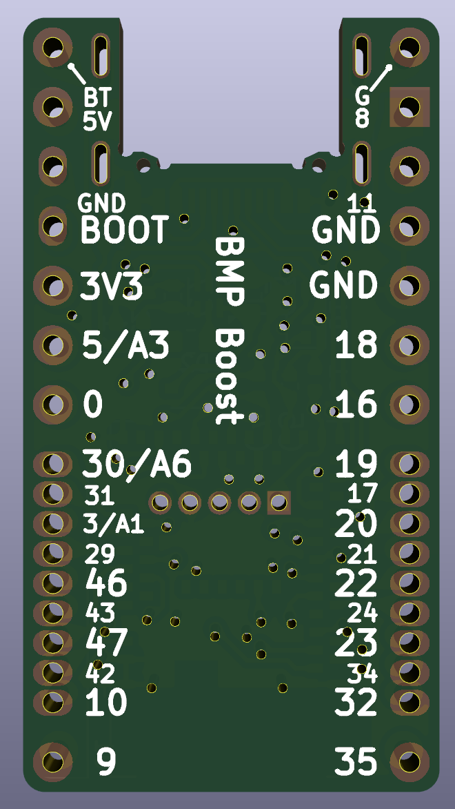
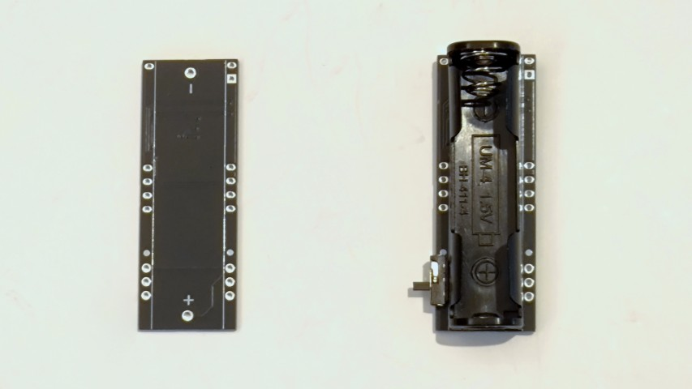
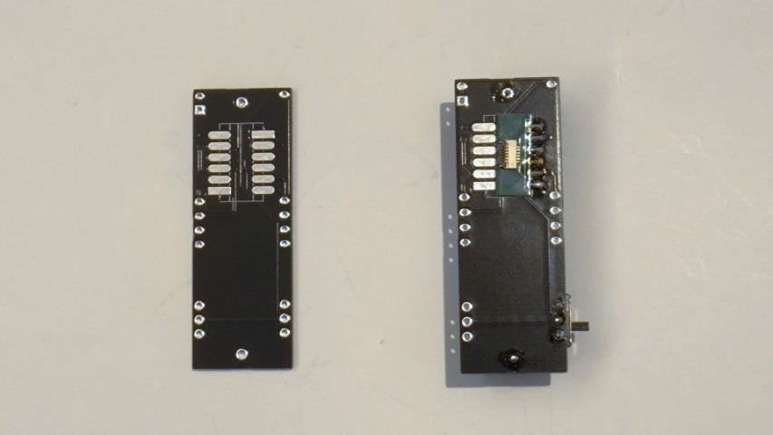
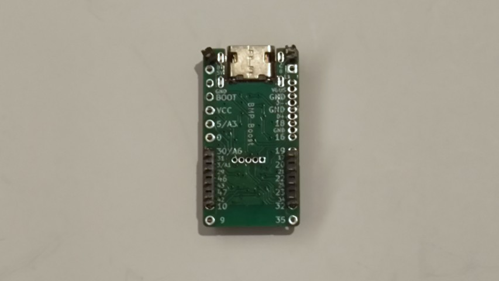
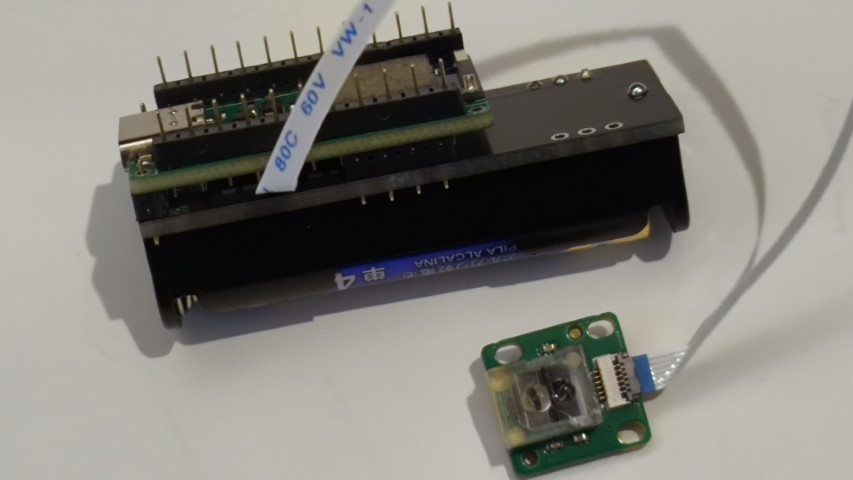

# BMP Boost


## 概要

BMP Boostは、DC-DC昇圧コンバータを搭載したnRF52開発ボードです。電池一本（0.7V以上）で動作可能で、キーボードやその他の低消費電力ワイヤレスプロジェクト向けに設計されています。

ZMK FirmwareやBLE Micro Pro用のファームウェアで動作します。

- [BOOTH](https://nogikes.booth.pm/items/1177319)
- [遊舎工房](https://shop.yushakobo.jp/products/10737)

## 特徴

- DC-DC昇圧コンバータ内蔵で電池一本（0.7V～）から動作可能
- ZMKまたはBLE Micro Pro用のQMKで動作可能
- 追加IOが必要な場合は、コンスルーのピンを差し替えて一部をハーフピッチにして拡張可能（ZMKのみ）

## ピン配置



### 電源コネクタ

| ラベル | 機能                                   |
| ------ | -------------------------------------- |
| BT     | 電源入力(0.7~3.3V)、AIN4で電圧測定可能 |
| G      | 電源入力GND                            |

### Pro Micro互換コネクタ

| ピン番号 | ラベル | GPIO番号 | 機能                                          |
| -------- | ------ | -------- | --------------------------------------------- |
| 1        | 8      | P0.08    | GPIO                                          |
| 2        | 11     | P0.11    | GPIO                                          |
| 3        | GND    |          | GND                                           |
| 4        | GND    |          | GND                                           |
| 5        | 18     | P0.18    | GPIO                                          |
| 6        | 16     | P0.16    | GPIO                                          |
| 7        | 19     | P0.19    | GPIO                                          |
| 8        | 20     | P0.20    | GPIO                                          |
| 9        | 22     | P0.22    | GPIO                                          |
| 10       | 23     | P0.23    | GPIO                                          |
| 11       | 32     | P1.00    | GPIO                                          |
| 12       | 35     | P1.03    | GPIO                                          |
| 13       | 9      | P0.09    | GPIO                                          |
| 14       | 10     | P0.10    | GPIO                                          |
| 15       | 47     | P1.15    | GPIO                                          |
| 16       | 46     | P1.14    | GPIO                                          |
| 17       | 3/A1   | P0.03    | GPIO/AIN1                                     |
| 18       | 30/A6  | P0.30    | GPIO/AIN6                                     |
| 19       | 0      | P0.00    | GPIO                                          |
| 20       | 5/A3   | P0.05    | GPIO/AIN3                                     |
| 21       | VCC    |          | VCC出力(約2.4V *1)                              |
| 22       | BOOT   |          | GNDに落として電源を入れるとブートローダを起動 |
| 23       | GND    |          | GND                                           |
| 24       | 5V     |          | 電源入出力(5V)                                |

\*1 VCC出力にLED（WS2812など）が接続されていると消費電力が著しく増加します。
LEDを実装しないか、実装してしまっている場合はコンスルーのピンを抜いて接続しないようにしてください。
また、起動電流が大きいデバイスを接続している場合、昇圧動作がうまく始まらない場合があります。

### 追加IO

| ラベル | GPIO番号 | 機能    |
| ------ | -------- | ------- |
| VBUS   |          | USB電源 |
| D-     |          | USBのD- |
| D+     |          | USBのD+ |
| 17     | P0.17    | GPIO    |
| 21     | P0.21    | GPIO    |
| 24     | P0.24    | GPIO    |
| 34     | P1.02    | GPIO    |
| 42     | P1.10    | GPIO    |
| 43     | P1.11    | GPIO    |
| 29     | P0.29    | GPIO    |
| 31     | P0.31    | GPIO    |

## ZMK用コンポーネント

- [zmk-component-bmp-boost](https://github.com/sekigon-gonnoc/zmk-component-bmp-boost)
- [QMK用のinfo.jsonをZMK用の設定に変更するツール](https://sekigon-gonnoc.github.io/bmp-qmk-zmk-converter/)
  - 変換結果が正しいとは限らないので適宜修正してください

## 注意事項

- BMPと違いI2Cのレベル変換機能はありません。
- BMPとは電源ピン（VCC）の機能が異なります。
- 仕様等は予告なく変更となる場合があります。

## BMP Boost用拡張ボード

### bmp-boost-extender

[KiCADプロジェクトデータ](./bmp-boost-extender/)

追加IOポートを利用してBMP Boostの背面に搭載できる単四電池基板です。
オプションとしてFFC変換基板を取り付けることもできます。

|        |          |
| -------------------------------- | ------------------------------------- |
|  |  |

### BMP Boost Extender Mini

[リポジトリ](https://github.com/ngsyst/bmp_boost_extender_mini)

ngsystさんが公開している小型の拡張基板です。FFCコネクタがハンダ付けされておりトラックボールやトラックパッドモジュール、エンコーダと接続可能です。

### bmp-boost-led-extender

[KiCADプロジェクトデータ](./bmp-boost-led-extender/)

緑・黄・赤の三色のLEDを追加する拡張基板です。本基板もFFCケーブルで拡張モジュールを接続できます。

### デバイスツリーの例

オプションのFFC変換基板を使用して[paw3222センサ](https://github.com/sekigon-gonnoc/small-mouse-sensor-module)と接続する場合は下記をデバイスツリーに追加してください。

```dts
&pinctrl {
    spi0_default: spi0_default {
        group1 {
            psels = <NRF_PSEL(SPIM_SCK, 0, 17)>,
                <NRF_PSEL(SPIM_MOSI, 0, 21)>,
                <NRF_PSEL(SPIM_MISO, 0, 21)>;
        };
    };

    spi0_sleep: spi0_sleep {
        group1 {
            psels = <NRF_PSEL(SPIM_SCK, 0, 17)>,
                <NRF_PSEL(SPIM_MOSI, 0, 21)>,
                <NRF_PSEL(SPIM_MISO, 0, 21)>;
            low-power-enable;
        };
    };
}

&spi0 {
    status = "okay";
    compatible = "nordic,nrf-spim";
    pinctrl-0 = <&spi0_default>;
    pinctrl-1 = <&spi0_sleep>;
    pinctrl-names = "default", "sleep";
    cs-gpios = <&gpio0 31 GPIO_ACTIVE_LOW>;

    trackball: trackball@0 {
        status = "okay";
        compatible = "pixart,paw3222";
        reg = <0>;
        spi-max-frequency = <2000000>;
        irq-gpios = <&gpio0 29 GPIO_ACTIVE_LOW>;
        power-gpios = <&gpio0 24 (GPIO_ACTIVE_HIGH | NRF_GPIO_DRIVE_H1)>;
    };
};
```

KiCadで作成した基板の設計データは[こちら](bmp-boost-extender/)

