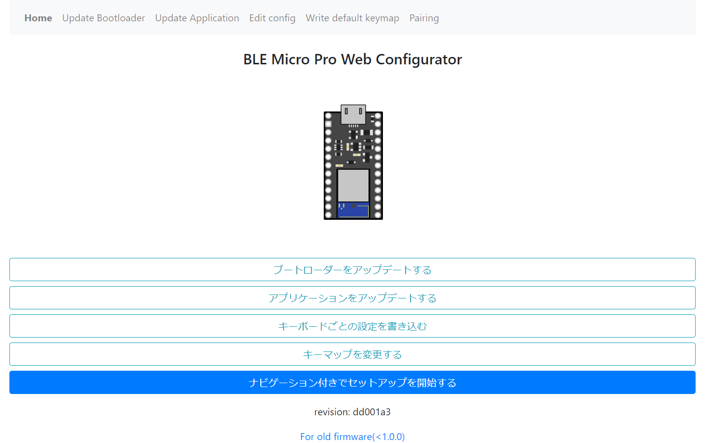
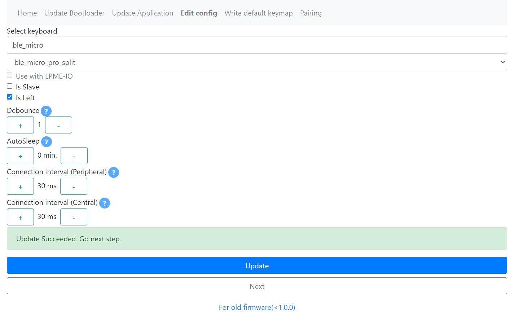
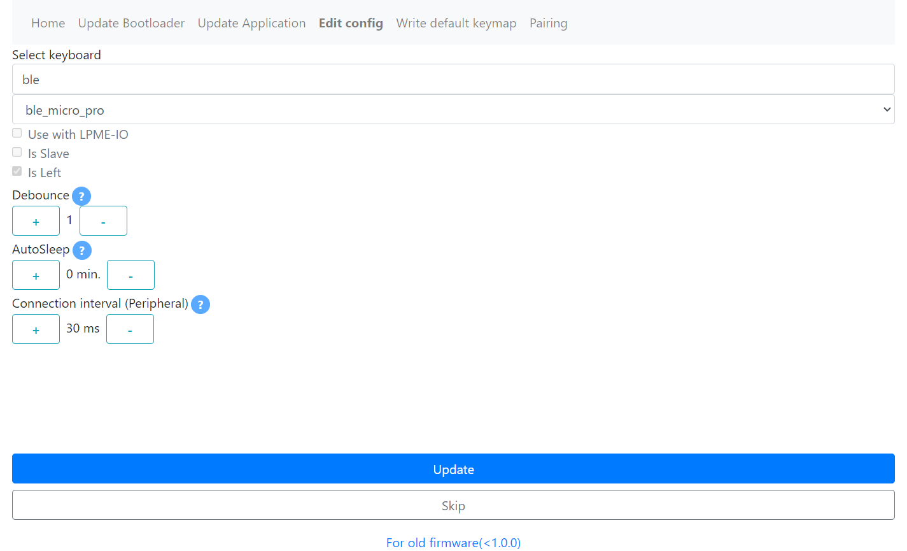
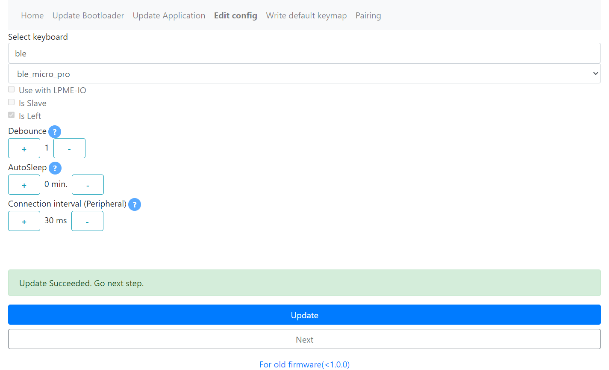
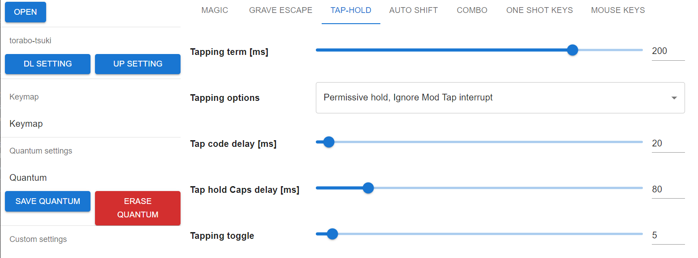
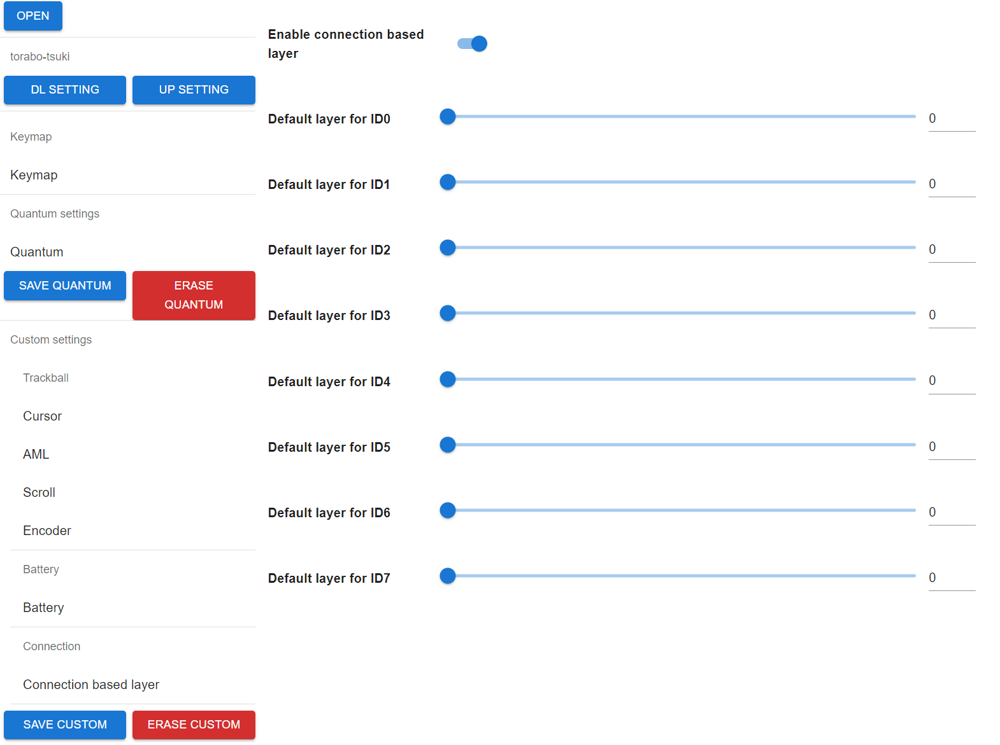

# 自作キーボードキットを無線化する

- [ハードウェアの準備](#ハードウェアの準備)
  - [BLE Micro Proを取り付ける準備](#ble-micro-proを取り付ける準備)
  - [電源の準備](#電源の準備)
- [BLE Micro Pro Web Configuratorを使ってファームウェアを書き込む](#ble-micro-pro-web-configuratorを使ってファームウェアを書き込む)
  - [キーボードを選ぶ](#キーボードを選ぶ)
  - [ファームウェアのアップデート](#ファームウェアのアップデート)
    - [ファームウェアの書き込みに失敗した場合](#ファームウェアの書き込みに失敗した場合)
  - [設定ファイルの書き込み](#設定ファイルの書き込み)
    - [分割キーボードのマスター側](#分割キーボードのマスター側)
    - [分割キーボードのスレーブ側](#分割キーボードのスレーブ側)
    - [一体型キーボード](#一体型キーボード)
  - [キーマップの書き込み](#キーマップの書き込み)
    - [キーマップ設定の変更](#キーマップ設定の変更)
  - [ペアリングする](#ペアリングする)
    - [(分割型のみ)マスターとスレーブの接続](#分割型のみマスターとスレーブの接続)
    - [パソコン等とのペアリング](#パソコン等とのペアリング)

## ハードウェアの準備

### BLE Micro Proを取り付ける準備

キーボード基板への取り付けにピンヘッダでなくコンスルーを使うことができます。([遊舎工房販売ページ](https://yushakobo.jp/shop/a01mc-00/), [TALP keyboard販売ページ](https://talpkeyboard.stores.jp/items/5e056626d790db16e2889233), [Switch Science 販売ページ](https://www.switch-science.com/catalog/3763/))。 BLE Micro Proはコンスルー対応なので、はんだづけは不要です。

BLE Micro Pro対応を前提に設計されたキーボードキットでは13ピンのコンスルーが必要な場合があります。キーボードキットの必要部品をよく確認してください。それ以外の場合は12ピンのコンスルーを使用するか、13ピンコンスルーをカットしてください。

### 電源の準備

無線運用するにはバッテリーから電源供給する必要があります。

キーボードキットが電池搭載に対応していない場合は、BLE Micro Proに直接電池を接続してください。BLE Micro Pro用に設計された電源基板としては単4電池基板([BOOTH販売ページ](https://nogikes.booth.pm/items/2710739))またはコイン電池基板([遊舎工房販売ページ](https://yushakobo.jp/shop/ble-micro-pro-battery-board/)、[BOOTH販売ページ](https://nogikes.booth.pm/items/1655285))があります。  

## BLE Micro Pro Web Configuratorを使ってファームウェアを書き込む

Google Chromeから[BLE Micro Pro Web Configurator](https://sekigon-gonnoc.github.io/BLE-Micro-Pro-WebConfigurator/)にアクセスするとブラウザからファームウェアのアップデートや各種設定ができます。  

### キーボードを選ぶ

`ナビゲーション付きでセットアップを開始する`ボタンを押すとキーボードの選択画面が表示されます。
リストから無線化したいキーボードを選んでください。

無線化したいキーボードがリストにない場合には、[BMP用の設定を生成する](about_config_files.md)必要があります。また、トラックボール搭載のキーボードなどはデフォルトのファームウェアでは対応できないので、[ファームウェアのビルド](build_firmware.md)が必要です。
設定生成が完了したら、ここでは`ble_micro_pro`または`ble_micro_pro_split`を選択してください。

|||
|--|--|
|ホーム画面|キーボード選択画面|

キーボード選択画面では2つのオプションが選択できます。

- Disable Mass Storage Class
  - BLE Micro Proにファームウェアを書き込むとパソコンにUSBケーブルで接続したときに大容量記憶デバイスとして認識されます。セキュリティの都合などで、大容量記憶デバイスとして認識されると困る場合にはこのオプションにチェックを入れることで機能を無効化できます。

- Use with LPME-IO（分割型のみ）
  - 分割型キーボードを無線化するときにBLE Micro Proを2台使った完全無線化をするのではなく、BLE Micro ProとLPME-IOを組み合わせた部分無線化をする場合にはこのオプションにチェックを入れてください。  
  - LPME-IOを使用するにはキーボード側が対応している必要があります。

構成を選択し終わったら`Next`ボタンを押すと次の手順に進みます。

### ファームウェアのアップデート

BLE Micro Proにはブートローダとアプリケーションという2種類のファームウェアを書き込みます。

* リストから最新版のブートローダーを選択してください。
* `Update`をクリックするとUSBデバイスへのアクセスを求めるポップアップが表示されます。
* USBケーブルでBLE Micro ProをPCに接続してください。
   * 分割キーボードの場合はまずマスター側(USB接続でのキー入力に対応させたいほう)をセットアップしてください。
* ポップアップにあたらしく表示されたデバイスを選択して`接続`をクリックすると書き込みが始まります。
  * デバイス名は画像と異なる場合があります。
* 書き込みが成功したら一度USBケーブルを抜き差しし、`Next`をクリックして次のステップに進んでください。
  * 緑色ではなく青や赤の表示が出たら後述の書き込み失敗時の手順を確認してください。
 
|  |  |  |
| ------------------ | -------------------- | ------------------ |

* リストから最新版のファームウェア(`ble_micro_pro_vial_x_y_z`)を選択してください。
* `Update`をクリックするとUSBデバイスへのアクセスを求めるポップアップが表示されます。
* BLE Micro Proを選択して`接続`をクリックすると書き込みが始まります。
  * どのデバイスがBLE Micro Proか分からない場合はUSBケーブルを抜き差ししてデバイス一覧の変化を確認してください。
* 書き込みが成功したら`Next`をクリックして次のステップに進んでください。

|  |  |  |
| ------------------ | -------------------- | ------------------ |

#### ファームウェアの書き込みに失敗した場合

*  "Boot loader is activated. ~"と表示されている場合はそのままもう一度`Update`ボタンをクリックしてください。
*  "Failed to ~"と表示されている場合は他のソフトでシリアルポートを開いていないか確認してください。

|  |  |
| ------------------ | ------------------- |

オプションについて

ファームウェア書き込み時に`Disable Mass Storage Class`のチェックを入れると、
USB接続時にリムーバブルディスクとして認識されなくなります。

ファームウェアのバージョンについて

2つのファームウェアのバージョンは`<major>.<minor>.<revision>`の3つの数字の組み合わせで表されていて、ブートローダとアプリケーションのメジャーバージョンとマイナーバージョンは一致させる必要があります。

特別な事情がない限りは両方ともデフォルトで選択されている最新版を利用してください。なお、メジャーまたはマイナーバージョンが異なるファームウェアへのダウングレード後の動作は保証されません。

### 設定ファイルの書き込み

設定ファイルの書き込み画面でもキーボードの選択リストが表示されます。
ナビゲーション付きでセットアップを開始した場合は最初に選択したキーボードとレイアウトが選択されているため、ここで選択し直す必要はありません。

自分で生成した設定を書き込みたい場合は、ここで`upload your own`を選択してください。

#### 分割キーボードのマスター側

ナビゲーション付きセットアップで分割キーボードのセットアップを開始した場合は、まずマスター側の設定を書き込みます。

BLE Micro Proを使用した分割キーボードでは、マスター側のみUSB接続でのキーボード動作に対応しています。

* `Is Slave`のチェックが外れていることを確認してください。
* 右側のキーボードをマスターにしたい場合は`Is Left`のチェックも外してください。
* LPME-IOを使用する場合は`Use with LPME-IO`にチェックを付けてください。
* `Update`をクリックするとUSBデバイスへのアクセスを求めるポップアップが表示されます。
* キーボードを選択して`接続`をクリックすると書き込みが始まります。
  * どのデバイスがBLE Micro Proか分からない場合はUSBケーブルを抜き差ししてデバイス一覧の変化を確認してください。
  * ポップアップにキーボードが表示されない場合はファームウェアの書き込みができていないので、最初のステップからリトライしてください。
* 書き込みが成功したら次のステップに進んでください。
  * 数十秒待っても書き込みが完了しなかったらブラウザをリロードしてUSBケーブルを抜き差してからリトライしてください。

|  |  |  |
| ------------------ | -------------------- | ------------------ |

ナビゲーション付きセットアップで分割キーボードのセットアップを開始した場合は、`Next`をクリックして次の画面に進んでください。画面の指示にしたがってBLE Micro Proを差し替えたら、`Next`をクリックすると、スレーブ側のファームウェア書き込み画面に移動します。

|  |
| ------------------  |

#### 分割キーボードのスレーブ側

* `Is Slave`のチェックが付いていることを確認してください。
* `Is Left`のチェックはマスター側と反転させてください。
* `Update`をクリックしてマスター側と同様に設定を書き込んでください。

スレーブ側の設定が完了したらファームウェア・設定の更新は完了です。マスター側をUSB接続し、キーマップの書き込みに進んでください。

#### 一体型キーボード

* `Update`をクリックするとUSBデバイスへのアクセスを求めるポップアップが表示されます。
* キーボードを選択して`接続`をクリックすると書き込みが始まります。
  * どのデバイスがBLE Micro Proか分からない場合はUSBケーブルを抜き差ししてデバイス一覧の変化を確認してください。
  * ポップアップにキーボードが表示されない場合はファームウェアの書き込みができていないので、最初のステップからリトライしてください。
* 書き込みが成功したら次のステップに進んでください。
  * 数十秒待っても書き込みが完了しなかったらブラウザをリロードしてUSBケーブルを抜き差してからリトライしてください。

|  |  |  |
| ------------------ | -------------------- | ------------------ |

オプションについて

- Use With LPME-IO（分割型のみ）
  - 前述の設定と同様です。デフォルトでは最初の画面で選んだ設定が引き継がれています。

- Is Slave（分割型のみ）
  - 分割型の場合、2つのBLE Micro ProにMaster/Slaveという役割が割り振られます。ナビゲーション付きでセットアップを開始した場合は手順に応じて自動的に選択されるため、変更する必要はありません。

- Is Left（分割型のみ）
  - いま設定しているBLE Micro Proを左手に取り付ける場合にはチェックを入れてください。

- Debounce
  - キー入力のチャタリング除去のパラメータです。デフォルトは1で、チャタリングがひどい場合にはチャタリングが無くなるまで1ずつ増やしてみてください。

- Connection interval(Peripheral)
  - 通信間隔の設定です。短くすると入力のラグが減る一方で、電力消費が増加します。
    - 一体型キーボード、または分割型キーボードのMasterを設定している場合はPCとの通信間隔を設定します。
    - 分割型キーボードのSlaveを設定している場合はMasterとの通信間隔を設定します。後述のMaster側の設定と合わせてください。
  
- Connection interval(Central)（分割型Masterのみ）
  - 分割型キーボードのSlaverとの通信間隔を設定します。前述のSlave側の設定と合わせてください。

### キーマップの書き込み

キーマップの書き込みには[VIA Custom UI for Vial](https://sekigon-gonnoc.github.io/via-custom-ui-for-vial/)を使用します。[Vial](https://vial.rocks/)にも対応しています。また、レイアウトが登録されていれば[Remap](https://remap-keys.app/)からも変更できます。VIA Custom UI for Vialのみ無線経由での書き込みにも対応しています。

Vialを使う場合の注意点

* Vialを利用する場合、ローカル版のVialでは電源投入後の初回の接続には必ず失敗してしまいます。エラーが表示されたらRefreshボタンを押して再読み込みしてください。ブラウザ版では自動でリトライされるため、再読み込みの操作は必要ありません
* 一度Vialと接続した場合、リセットするまでRemapには接続できなくなります。Remapに再接続したい場合は、リセットするか電源を再投入してください
* Remapのマクロ定義とVialのマクロ定義が異なるため、一方で編集したマクロはもう一方で正しく表示されない場合があります。どちらで定義してもマクロの実行は可能です
* USBでの接続のみ対応しています

 

ここではVIA Custom UI for Vialを使った書き換えを説明します。他のサイトを使用する場合は、それぞれの説明を適宜参照してください。

* キーボードのマスター側をUSB接続してください。
* `OPEN`ボタンをクリックして表示されるポップアップから、設定を変更したいキーボードを選択して接続してください。

接続に成功すると画面左側にメニュー一覧が表示されます。`Keymap`, `Quantum`はキーボードによらず表示されるメニューです。`Custom settings`はキーボード固有のメニューです。

|||
|-|-|
||

`Keymap`を選択すると画面右側にキーのレイアウトが表示されます。

|番号|機能|
|-|-|
|1|レイアウト選択|
|2|レイヤー選択|
|3|キーマップ|
|4|キーリストの言語切り替え|
|5|キーリスト|

キーリストからキーをドラッグアンドドロップするか、キーマップ中のキーをクリックして表示されるポップアップで編集するとキーマップを書き換えられます。書き換え内容は変更した時点で保存されます。

|||
|-|-|

キーリストの`User/Wireless`タブには、BLE Micro Pro用に無線接続関連などいくつかのカスタムキーコードが組み込まれています。最低限、以下のキーコードをキーマップに設定することをおすすめします
  - Remapでは`BMP`タブまたは`FUNCTIONS`タブの`VIA USER KEY`からこれらのキーが設定できます
  - Vialでは`User`タブからこれらのキーが設定できます

  |キーコード|機能|
  |-|-|
  |AD_WO_L|ホストの接続、スレーブの探索を開始する。新しいデバイスとペアリングできる|
  |ADV_IDn|n番目にペアリングしたデバイスと接続しようとする|
  |SEL_USB|USB接続を経由して送信する|
  |SEL_BLE|BLE接続を経由して送信する|
  |BATT_LV|バッテリーの電圧を表示する(文字列が自動で入力されます)|
  |ENT_SLP|スリープモードに入る|
  |EN_WEBBT(QK_KB25)|無線経由でのキーマップ書き換えを有効化（1.4.0以降, スマホにも対応）|
  |DIS_WEBBT(QK_KB26)|無線経由でのキーマップ書き換えを有効化（1.4.0以降, スマホにも対応）|

  その他のカスタムキーコードとして、英語キーボードを日本語OSで動作させるためのオーバーライド(UJ OVR)や、日本語キーボードを英語OSで動作させるためのオーバーライド(JU OVR)にも対応しています。

  EN_WEBBTを押すとスマホやタブレットでもキーマップが書き換えられるモードになります。このモードの間は通常のキー入力はできないので、キーマップ書き換えが終わったら`DIS_WEBBT`でモードを抜けるか、電源を入れ直してください。

  safariはWeb bluetoothに対応していないのでbluefyを使用してください。

#### キーマップ設定の変更

`Quantum`メニューから、Tapping termなどQMKのキーマップ設定が変更できます。設定変更後、`Save Quantum`ボタンをクリックすると保存されます。各メニューの詳細についてはVialおよびQMKのドキュメントを参照してください。

`Custom settings`で変更した設定は`Save Custom`ボタンをクリックすると保存されます。
`Connection based layer`を有効にすると無線接続先ごとにデフォルトレイヤーを変更できます。

### ペアリングする

#### (分割型のみ)マスターとスレーブの接続

左右間のペアリングは両手の電源がONしてから数秒間のみ行われます。マスター側の電源を入れてから数秒以内にスレーブ側の電源を入れてください。

#### パソコン等とのペアリング

- キーボード起動直後から数秒間、または`AD_WO_L`を配置したキーを押下するとBLE Micro Proがアドバタイズを開始します。その後、ペアリングしたい機器からスキャンを実行して、キーボードが表示されたら選択して登録してください。
  - 2台目以降のデバイスとペアリングする場合は、他のペアリング済みデバイスのBluetoothを無効化してから`AD_WO_L`を実行してください。
  - 指定したペアリング済みパソコン等に接続したい場合、`ADV_IDx`を実行します。`x`はペアリング番号(0-7)です。分割型の場合、ID0はスレーブです。

ペアリングに関するトラブルの解決には再ペアリングが有効です。手順は[FAQ](FAQ.md)を参照してください。